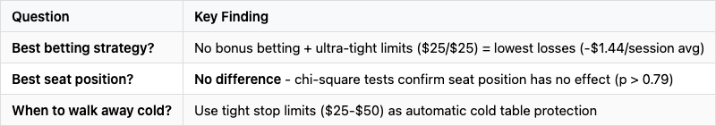
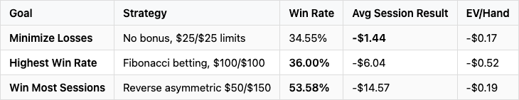
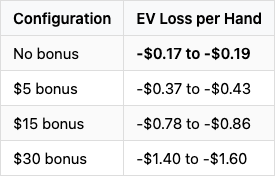
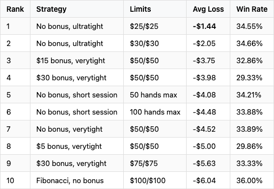
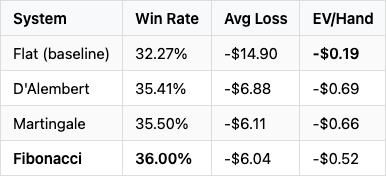
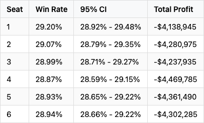
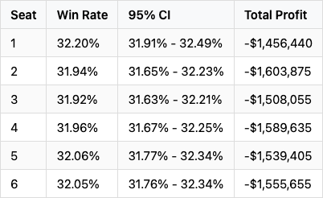
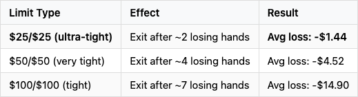
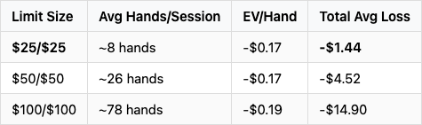
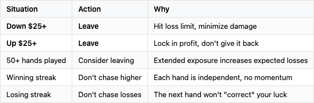

## Let It Ride Strategy Analysis

**Based on:** 5.1M+ simulated sessions across 51 strategy configurations
**Dataset:** 100,000 sessions per configuration, $500 starting bankroll, $5 base bet

---

## Executive Summary



---

## Key Terms

### EV/Hand (Expected Value per Hand)

**Expected Value (EV)** is the average amount you can expect to win or lose per hand over the long run. It's calculated as:

```
EV = (Total Money Won or Lost) / (Total Hands Played)
```

For example, an EV/Hand of **-$0.17** means:
- On average, you lose 17 cents per hand played
- Over 100 hands, expect to lose ~$17
- Over 1,000 hands, expect to lose ~$170

**Why EV matters:** It measures the true cost of playing regardless of session outcomes. A strategy with lower EV/Hand costs less to play over time, even if individual sessions vary wildly.


---

## Question 1: What is the most reliable betting strategy to end up with the most money?

### Answer: No Bonus Betting with Tight Stop Limits

The most reliable strategy depends on your goal:



### Key Insight: Avoid Bonus Bets

The three-card bonus side bet dramatically increases your expected losses:



**The bonus bet roughly doubles (or triples) the house edge per hand.**

### Top 10 Strategies by Lowest Average Loss



### Progressive Betting Systems Comparison

Progressive betting increases win rate but also increases per-hand expected loss:



#### How Each System Works

**Flat Betting (Baseline):** Bet the same amount every hand regardless of wins or losses. The simplest approach with the lowest EV loss per hand, but also the lowest win rate.

**Martingale:** Double your bet after each loss, reset to base bet after a win. Designed to recover all losses with a single win. Risk: bet sizes grow exponentially during losing streaks (e.g., $5 → $10 → $20 → $40 → $80).

**D'Alembert:** Increase bet by one unit after a loss, decrease by one unit after a win. A gentler progression than Martingale with linear (not exponential) bet growth. Self-correcting during winning streaks.

**Fibonacci:** Follow the Fibonacci sequence (1, 1, 2, 3, 5, 8, 13...) for bet sizing after losses, regress two positions after a win. Slower progression than Martingale but still recovers losses over time. Mathematically elegant but complex to track.

**Note:** Progressive systems don't change the house edge - they only reshape the variance profile. You win more sessions but lose more per hand on average due to larger bet sizes.

### Recommendation

**For maximum money preservation:** No bonus betting + $25/$25 stop limits
- Average loss: Only -$1.44 per session
- Win rate: 34.55% (1 in 3 sessions profitable)
- Best "entertainment value per dollar"

---

## Question 2: What seat position has the best odds of making the most money (or losing the least)?

### Answer: Seat Position Has NO Effect

Statistical analysis of 1.2 million rounds across two datasets confirms that seat position does not affect outcomes.

### Understanding the Statistical Test

**Chi-Square Test:** A statistical method that compares observed results to expected results to determine if differences are meaningful or just random chance. Here, it tests whether win rates differ significantly between seat positions.

**P-value:** The probability that the observed differences occurred by random chance alone.
- **p > 0.05:** Differences are NOT statistically significant (likely just random variation)
- **p < 0.05:** Differences ARE statistically significant (likely a real effect)

**How to interpret:** A p-value of 0.795 means there's a 79.5% probability that the seat-to-seat differences we observed are just random noise. Since this is well above the 0.05 threshold, we conclude seat position has no real effect.

### Dataset 1: With $5 Bonus Bet (600,000 rounds)



**Chi-Square Test:** X² = 2.37, p-value = **0.795**
**Interpretation:** p > 0.05 means NO statistically significant difference between seats

### Dataset 2: No Bonus Bet (600,000 rounds)



**Chi-Square Test:** X² = 1.68, p-value = **0.892**
**Interpretation:** p > 0.05 confirms NO seat position effect

### Why Seat Position Doesn't Matter

In Let It Ride:
1. All players share the same two community cards
2. Each player's three hole cards are dealt independently
3. No player action affects another's hand (unlike poker)
4. The dealer does not compete against players

**Conclusion:** Pick any seat - your odds are identical. The observed 0.3% variance between seats is statistical noise, not a real effect.

---

## Question 3: When should a player walk away from a "cold" table?

### Answer: Use Tight Stop Limits as Automatic Cold Table Protection

Since Let It Ride outcomes are independent (each hand is a fresh deal), there's no true "cold table" - the table doesn't remember previous hands. However, **tight stop limits effectively protect against losing streaks**.

### How Stop Limits Act as Cold Table Protection



### The Math Behind "Cold" Protection

With a $5 base bet (3 spots = $15 per hand) and typical losing hand:

- **$25 loss limit:** ~2 losing hands max before exit
- **$50 loss limit:** ~4 losing hands max before exit
- **$100 loss limit:** ~7 losing hands max before exit

Tighter limits automatically pull you away before a "cold" streak compounds.

### Comparison: Session Length vs Losses



**Key insight:** Per-hand EV is similar across strategies (~$0.17-0.19), but total exposure time determines total losses.

### When to Walk Away - Practical Guidelines



### The Gambler's Fallacy Warning

**Important:** A "cold table" doesn't predict future results. Each hand is independent:
- Losing 5 hands in a row doesn't mean you're "due" for a win
- The next hand has the exact same odds regardless of history
- The house edge remains constant (~3.5% on main game)

Tight stop limits work not because they detect "cold" patterns, but because they **limit total exposure to the house edge**.

### Recommendation

**Set a loss limit of $25-$50 before sitting down.** This:
- Automatically protects against "cold" streaks
- Limits exposure to ~2-4 losing hands
- Results in average losses under $5 per session
- Preserves bankroll for future sessions

---

## Summary Recommendations

### The Optimal Let It Ride Strategy

1. **Skip the bonus bet** - It roughly doubles the house edge
2. **Set tight stop limits** ($25-$50 win/loss) - Limits exposure, minimizes losses
3. **Don't chase wins** - Asymmetric strategies (high win target, low loss limit) underperform
4. **Any seat is fine** - Position has no statistical effect
5. **Walk away early on losses** - The house edge grinds you down over time

### Expected Outcomes with Optimal Strategy

Using **no bonus + $25/$25 limits**:
- **Win rate:** 34.55% (win 1 in 3 sessions)
- **Average loss:** $1.44 per session
- **100 sessions:** Expect ~35 winning sessions, ~$144 total loss
- **Entertainment cost:** ~$0.17 per hand (~$1.50 per hour at 8 hands/hour)

---

*Analysis based on 5.1M+ simulated sessions. See `/results/walkaway/ANALYSIS_SUMMARY.md` for complete methodology and all 51 strategy configurations.*
